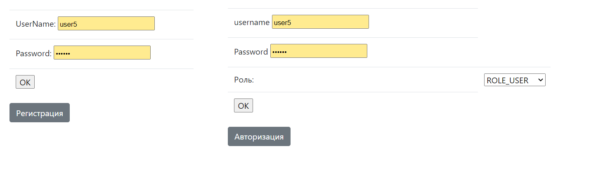
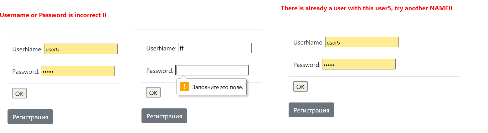
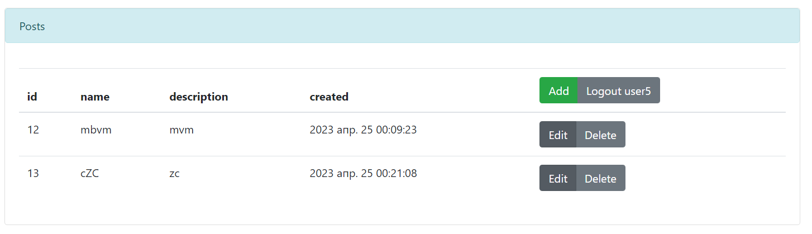
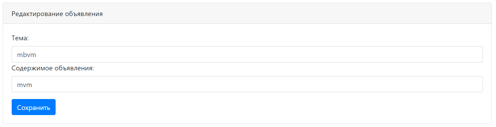
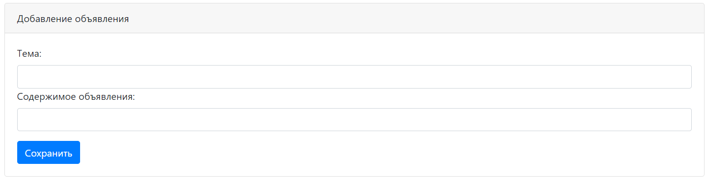

# job4j_forum на Spring Boot
Техническое задание - проект "Forum"

### Технологии проекта

Для работы с сайтом, необходима авторизация.

Контролируется заполненность полей и корректность данных авторизации.

На главной страницы выводиться список постов форума.

Можно редактировать или добавить, либо удалить пост.

